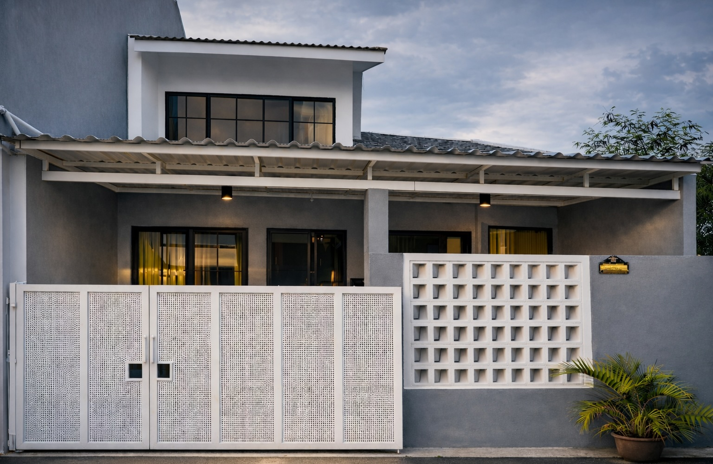

# 🏡 Rumah Dijual Bintaro — Graha Raya | Kiwi Residence

A modern one-page real estate website built with **Next.js 14 (App Router)** and **Tailwind CSS**, showcasing a house for sale at **Cluster Kiwi Residence, Graha Raya, Bintaro**.  
The site features a responsive photo gallery, interactive map, and quick contact via WhatsApp.



---

## ✨ Features

- 🏠 **Property Details** — Full description, specs, and key features  
- 🖼️ **Image Gallery** — Click-to-open lightbox with swipe and arrow navigation  
- 🗺️ **Map Integration** — Embedded OpenStreetMap and link to Google Maps  
- 📱 **WhatsApp & Email Contact** — Instant inquiry buttons  
- 💡 **SEO Optimized** — For keywords “Rumah Dijual Bintaro”, “Graha Raya”, etc.  
- 🌈 **IKEA-inspired Color Palette** — Clean and friendly aesthetic  
- 🚀 **Free Deployment** — Hosted on [Vercel](https://vercel.com)

---

## 🧩 Tech Stack

- [Next.js 14 (App Router)](https://nextjs.org/)
- [Tailwind CSS](https://tailwindcss.com/)
- [Lucide React](https://lucide.dev/) — lightweight icon set for React
- [Vercel](https://vercel.com) — deployment and hosting

---

## 📦 Installation & Local Setup

Clone this repository and install dependencies:

```bash
git clone https://github.com/<your-username>/rumah-bintaro.git
cd rumah-bintaro
npm install
