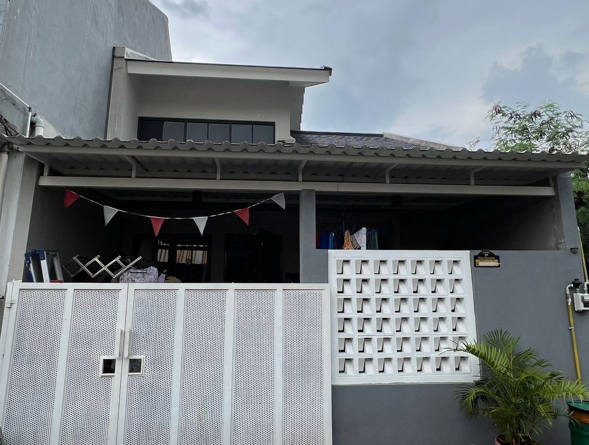

# 🏡 Rumah Dijual Bintaro — Graha Raya | Kiwi Residence

A modern, responsive one-page real estate website built with **Next.js 14 (App Router)** and **Tailwind CSS**, showcasing a house for sale at **Cluster Kiwi Residence, Graha Raya, Bintaro, Tangerang Selatan**.  

The site features smooth animations, responsive photo gallery, interactive map integration, and instant contact options optimized for both desktop and mobile devices.



---

## ✨ Features

### 🏠 Property Showcase
- **Hero Section** — Eye-catching hero with property image and floating stats card
- **Detailed Specifications** — Bedrooms, mezzanine, land area, utilities, and garage info
- **Key Highlights** — Proximity to toll road, hospitals, and shopping centers
- **Responsive Layout** — Optimized viewing experience on all devices

### 🖼️ Interactive Gallery
- **Lightbox Gallery** — Click any image to view in full screen
- **Multi-Navigation** — Keyboard arrows, on-screen buttons, and touch swipe support
- **Optimized Images** — Next.js Image component for fast loading

### 🗺️ Location & Map
- **Embedded Map** — OpenStreetMap integration with clickable overlay
- **Google Maps Link** — Direct navigation to property location
- **Points of Interest** — Visual markers for nearby amenities

### 📱 Contact & Conversion
- **WhatsApp Integration** — Pre-filled message for instant inquiry
- **Email Contact** — Direct mailto link with subject line
- **Analytics Tracking** — Vercel Analytics for conversion tracking
- **Mobile-First CTAs** — Optimized button layout for mobile screens

### 🎨 Design & UX
- **Smooth Animations** — Framer Motion scroll-triggered animations
- **Sticky Navigation** — Always-accessible header with active section highlighting
- **Clean Typography** — Serif headings with modern sans-serif body text
- **Scroll Spy** — Auto-highlighting navigation based on scroll position

### 💡 SEO & Performance
- **SEO Optimized** — Meta tags, sitemap, and semantic HTML
- **Dynamic Sitemap** — Auto-generated XML sitemap for search engines
- **Fast Loading** — Optimized images and efficient code splitting
- **Mobile Responsive** — Perfect rendering on all screen sizes

---

## 🧩 Tech Stack

- **Framework:** [Next.js 14 (App Router)](https://nextjs.org/)
- **Styling:** [Tailwind CSS](https://tailwindcss.com/)
- **Animations:** [Framer Motion](https://www.framer.com/motion/)
- **Icons:** [Lucide React](https://lucide.dev/)
- **Analytics:** [Vercel Analytics](https://vercel.com/analytics)
- **Deployment:** [Vercel](https://vercel.com)
- **Image Optimization:** Next.js Image Component
- **Maps:** OpenStreetMap + Google Maps

---

## 📦 Installation & Local Setup

### Prerequisites
- Node.js 18+ 
- npm or yarn

### Clone and Install

```bash
git clone https://github.com/idhamchoudry/rumah-bintaro.git
cd rumah-bintaro
npm install
```

### Run Development Server

```bash
npm run dev
```

Open [http://localhost:3000](http://localhost:3000) to view the site locally.

### Build for Production

```bash
npm run build
npm start
```

---

## 🚀 Deployment

This project is optimized for deployment on [Vercel](https://vercel.com):

1. Push your code to GitHub
2. Import the repository in Vercel
3. Vercel will automatically detect Next.js and configure the build
4. Your site will be live in minutes!

[](https://vercel.com/new/clone?repository-url=https://github.com/idhamchoudry/rumah-bintaro)

---

## 📝 Customization

### Update Property Data

Edit the `DATA` object in `src/app/HouseListing.tsx`:

```typescript
const DATA = {
  title: "Your Property Title",
  priceLabel: "Rp X,XXX M",
  contact: {
    name: "Your Name",
    phoneIntl: "628xxxxxxxxxx",
    email: "your@email.com",
  },
  // ... more fields
};
```

### Add/Replace Images

1. Place your images in the `/public` folder
2. Update the `images` array in the `DATA` object
3. Images are automatically optimized by Next.js

### Customize Colors

Edit `src/app/globals.css` to change the color scheme:

```css
:root {
  --color-accent: #0046be;
  --color-heading: #111111;
  /* ... other color variables */
}
```

---

## 📊 Analytics

The site includes Vercel Analytics for tracking:
- Page views
- WhatsApp button clicks
- Email button clicks
- User engagement metrics

Analytics data is available in your Vercel dashboard.

---

## 📄 License

This project is open source and available under the [MIT License](LICENSE).

---

## 👤 Contact

**Idham Choudry**
- Website: [https://rumah-bintaro.vercel.app](https://rumah-bintaro.vercel.app)
- Email: cnorson@gmail.com
- WhatsApp: +62 859-2986-7810

---

## 🙏 Acknowledgments

- Built with [Next.js](https://nextjs.org/)
- Icons by [Lucide](https://lucide.dev/)
- Maps by [OpenStreetMap](https://www.openstreetmap.org/)
- Hosted on [Vercel](https://vercel.com/)
